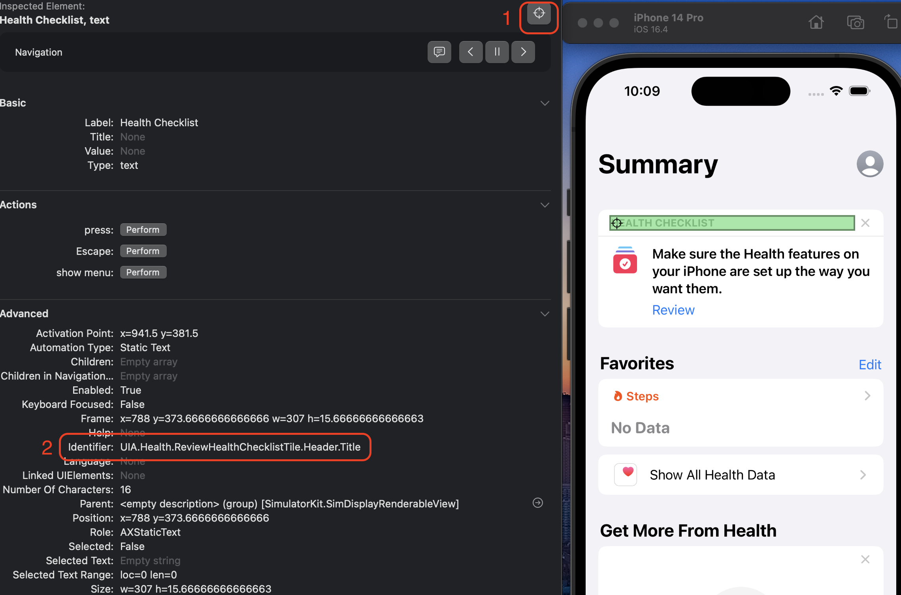

# Composing Accessibility Identifiers for SwiftUI Components

## What are accessibility identifiers?

Shortly, they are a way of locating an element in an iOS app. They can be used to uniquely and reliably identify an element (`XCUIElement`) in UI Automation Tests (`XCUITests`). The alternatives have either a low performance (`XPath`) or require specific selectors which may randomly fail to find an element. Still, it may be useful to know them. To learn about other options, check [the guide from BrowserStack](https://www.browserstack.com/guide/xcuitest-locators-to-find-elements) about finding elements.

For more information about accessibility identifiers, please visit [Apple's documentation](https://developer.apple.com/documentation/appkit/nsaccessibility/1535023-accessibilityidentifier).

To easily verify them, the best way is to use a views hierarchy preview provided by inspector tools.

## Previewing `XCUIElement`s structure

`XCUIElement`s have, the same as views, a tree structure. They are the two most known ways to preview them.

### Accessibility Inspector

The Accessibility Inspector is a tool provided with Xcode. It can be opened from Xcode's menu: Xcode -> Open Developer Tool -> Accessibility Inspector or cmd+space and type "accessibility inspector".

While the app is running on the simulator, from "All processes" in "Accessibility Inspector", choose "Simulator", and then click on the "Target an element" button (1). The "selection mode" will be turned on. Click on the element which you would like to inspect (green overlay will assist with choosing the right one). The accessibility identifier is under "Identifier" in the "Advanced" section (2). Below is an example of Health.app:



Accessibility Inspector comes with amazing tools which help you improve the accessibility of your app (e.g. contrast ratio scans). To learn more about Accessibility Inspector and its features, please, watch a [WWDC session from 2019](https://developer.apple.com/videos/play/wwdc2019/257).

### Appium Inspector

Appium Inspector requires more work to set up but in the end, it is more convenient to use for accessibility preview and provide data in readable form.

#### Installation

There are several tutorials on the internet about how to install Appium Inspector, but if would like not to spend so much of your time for looking, feel free to use the one below:

Appium Inspector requires `npm` and Appium Server. The simplest way is to install it through [homebrew](https://brew.sh) by typing these commands in the terminal:

```bash
brew install node # installs npm
```

```bash
npm install -g appium@next # installs appium server through npm
```

You may check the Appium installation by printing its version. You can do it by typing in the terminal:

```bash
appium -v
```

To run `XCUITests` or scan the tree structure, Appium needs an additional driver to install. To install the `XCUITest` driver, type in the terminal:

```bash
appium driver install xcuitest # installs Appium driver which allows to run XCUITest
```

You may check if the driver is successfully installed by listing down installed drivers. You can do that by typing in the terminal:

```bash
appium driver list --installed
```

Next, download the Appium Inspector installation package from Appium's Github: https://github.com/appium/appium-inspector/releases. In case of errors, please follow [Appium's installation guide]( https://github.com/appium/appium-inspector#installation).

#### Usage

First, run the Appium server by typing in the terminal:

```bash
appium server
```

Then, open the Appium Inspector app and define properties (1). You have to define at least `platformName` and `appium:automationName` as follows:

- `platformName`: use `iOS`
- `appium:automationName`: use `XCUITest`

You can save that configuration (it is not saved by default) for later use. To start a screen scanning process, click the "Start Session" button (2).


To know more about available options (like running on a physical device), please visit the [Appium's guide](https://appium.io/docs/en/2.0/guides/caps/).

Click on the element which you would like to inspect (an overlay will assist with choosing the right one). Below is the example of Health.app (with the same screen and identifier used in the previous example above):


Use the "Refresh" button from the top button list to refresh the screen and see the updated view data.

## Composing IDs

Now, as you know how to verify the identifiers, it's time to compose them. We are going to use a tree structure.


A tree is constructed with branches (1, 2) and leaves (3, 4, 5). Like in regular trees, a leaf cannot exist without at least one branch.

Take a look at the identifier from Health.app: `UIA.Health.ReviewHealthChecklistTile.Header.Title`. Each of its parts, separated by a dot, defines the next level of nesting, building a tree structure. In that case, the following parts: `UIA`, `Health`, `ReviewHealthChecklistTile`, and `Header` are branches and `Title` is a leaf.

As you may notice, a tree structure has the following key advantages:

- it allows better identifier organization;
- each nesting level provides more detail about the view placement, so it is easier to find it in view hierarchy;

The example of Apple's Health app is constructed by using the following format: `Purpose.App.ViewGroup.Component.Element`, but feel free to define your own (e.g. it is absolutely fine to use `ScreenName.ViewGroup.Component.Element` instead).

Composing indetifiers can be done by simply passing the identifier through a constructor like this:

```swift
struct UserDetails: View {

    let name: String
    private let parentIdentifier: String

    init(name: String, parentIdentifier: String) {
        self.name = name
        self.parentIdentifier = parentIdentifier
    }

    var body: some View {
        Text(name)
            .accessibilityIdentifier("\(parentIdentifier).xLabel")
    }
}
```

However, it is not enough flexible. First, it introduces an additional dependency passed through the constructor, polluting its API with UI-related dependency. Second, you are losing an option to set an "identifier branch" to regular `SwiftUI` view containers, like `VStack`. The best option would be to allow an identifier to be created in the same way as setting up the background color or padding to a `View` or a group of them.

To achieve that, we are going to use custom `EnvironmentKey` and `ViewModifier`s, starting with creating a dedicated `EnvironmentKey`:

```swift
import SwiftUI

struct ParentAccessibilityBranchKey: EnvironmentKey {

    static let defaultValue: String? = nil
}

extension EnvironmentValues {

    var parentAccessibilityBranch: String? {
        get { self[ParentAccessibilityBranchKey.self] }
        set { self[ParentAccessibilityBranchKey.self] = newValue }
    }
}
```

That environment value will be used to pass a branch name from the parent `View`, to its children. Once set to a parent, it is visible to all its childern views.

Next, let's create a dedicated `ViewModifier` for constructing a branch and a leaf.

Branch modifier:

```swift
import SwiftUI

public struct AccessibilityIdentifierBranchModifier: ViewModifier {

    @Environment(\.parentAccessibilityBranch) private var parentBranch

    private let branch: String

    public init(branch: String) {
        self.branch = branch
    }

    public func body(content: Content) -> some View {
        content
            .environment(\.parentAccessibilityBranch, makeGroupPath())
    }

    private func makeGroupPath() -> String {
        guard let parentBranch = parentBranch else { return branch }
        return "\(parentBranch).\(branch)"
    }
}

public extension View {

    func accessibilityIdentifierBranch(_ branch: String) -> ModifiedContent<Self, AccessibilityIdentifierBranchModifier> {
        modifier(AccessibilityIdentifierBranchModifier(branch: branch))
    }
}
```

The branch modifier takes a branch from a parent `View` and appends to it the branch provided in the constructor. The modifier only constructs the identifier but does not apply it to a `View`.

Leaf modifier:

```swift
public struct AccessibilityIdentifierLeafModifier: ViewModifier {

    @Environment(\.parentAccessibilityBranch) private var branch

    private let leaf: String

    public init(leaf: String) {
        self.leaf = leaf
    }

    public func body(content: Content) -> some View {
        if let branch = branch {
            content
                .accessibilityIdentifier("\(branch).\(leaf)")
                .environment(\.parentAccessibilityBranch, nil)
        } else {
            content
        }
    }
}

public extension View {

    func accessibilityIdentifierLeaf(_ leaf: String) -> ModifiedContent<Self, AccessibilityIdentifierLeafModifier> {
        modifier(AccessibilityIdentifierLeafModifier(leaf: leaf))
    }
}
```

The leaf modifier applies the identifier to a `View`. You have may noticed, that the `parentAccessibilityBranch` environment value is nullified for the leaf modifier. It prevents further branching creation, because is not feasible to grow a branch from a leaf. The leaf modifier closes the identifier creation.

While having all implementation done, let's create an example of a reusable `View`:

```swift
struct UserDetails: View {

    let name: String

    init(name: String) {
        self.name = name
    }

    var body: some View {
        HStack {
            Image(systemName: "person.circle")
                .resizable()
                .aspectRatio(contentMode: .fit)
                .frame(width: 40.0)

            VStack(alignment: .leading) {
                Text("Name")
                    .foregroundColor(.secondary)
                    .font(.caption)
                    .accessibilityIdentifierLeaf("Label")
                Text(name)
                    .accessibilityIdentifierLeaf("Value")
            }
        }
        .padding()
        .frame(maxWidth: .infinity, alignment: .leading)
        .background(.thinMaterial)
        .cornerRadius(10.0)
    }
}
```

and use it by another `View` with identifier modifiers:

```swift
struct ContentView: View {

    var body: some View {
        VStack {
            UserDetails(name: "Bugs Bunny")
                .accessibilityIdentifierBranch("UserDetails")
        }
        .padding()
        .accessibilityIdentifierBranch("Users")
    }
}
```

As a result of the above, let's take a look at the preview to verify the identifier:


## Conclusion

Setting up accessibility identifiers with custom SwiftUI components can be flexible without introducing an additional element to the `View`s constructor. SwiftUI provides an API that allows composing identifiers with the same feel as modifying a `View` with padding, background, and foreground color.

Although the solution above is flexible, bear in mind to build the identifier tree with caution, to prevent introducing frequent changes which may break the UI tests.

You may find the complete code in [my  GitHub repository](https://github.com/Filozoff/BlogArticles/tree/master/Article002).
